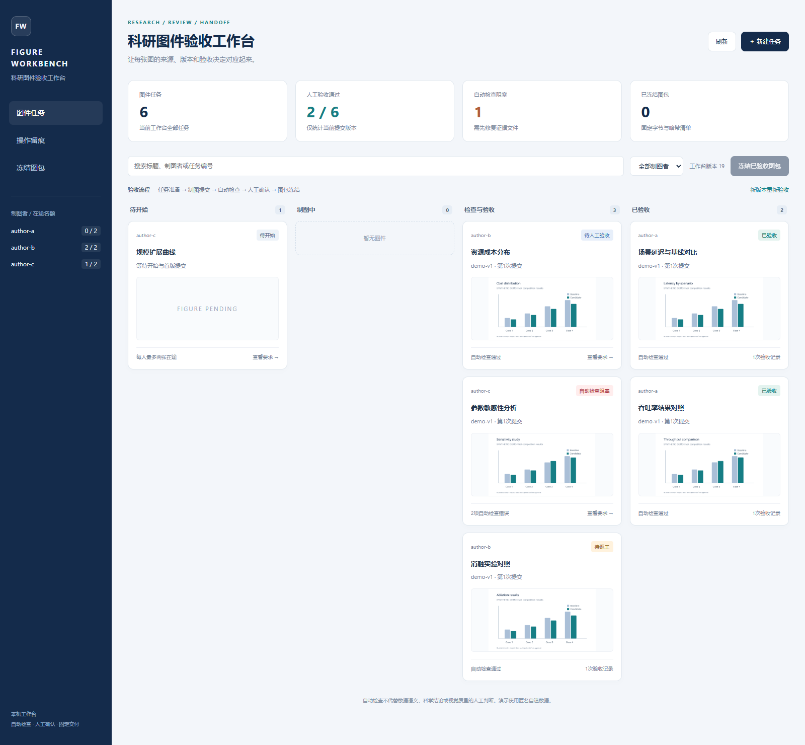
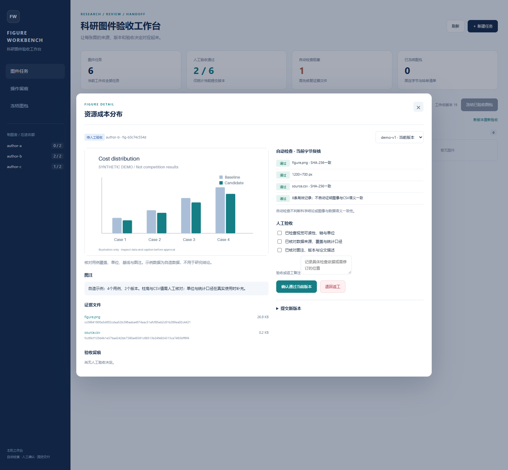

# Scientific Figure Workbench

**科研图件验收工作台 · 任务分配、版本复核、人工验收与固定图包**

[](https://github.com/yuanzhifang30-sudo/scientific-figure-workbench/actions/workflows/test.yml)

[English](README.en.md) · [设计与边界](docs/design.md) · [Agent Skill](skills/scientific-figure-review/SKILL.md)



## 项目来源

从研究生数学建模中的论文图件任务分配、返工、版本复核和验收实践提炼，独立整理实现一个可运行的本地原型。示例为6张匿名自造图件；演示验收记录明确标为模拟记录。仓库不包含比赛原图、团队源码、真实通信或私人资料。

本项目与[Research Evidence Kit](https://github.com/yuanzhifang30-sudo/research-evidence-kit)分别处理两个问题：前者管理图件的版本和验收交付；后者核验实验结果的覆盖与比较口径。

## 已实现

| 功能 | 行为 |
|---|---|
| 任务看板 | 新建任务、按制图者分配、搜索和筛选；每人最多两张在途 |
| 版本留痕 | 保存每次提交的PNG、来源CSV、可选源码和图注；新版本需要重新验收 |
| 自动检查 | 完整解码PNG、检查分辨率和单色图；验证CSV结构、有限数值、重复点与文件SHA-256 |
| 人工验收 | 三项人工确认与备注，绑定当前提交ID；明确记录通过或返工 |
| 版本对照 | 查看历史版本、图注、文件指纹、验收记录及相邻图像对照 |
| 图包冻结 | 全部当前版本通过后，导出固定ZIP、版本与验收清单、文件哈希；后续修改不改变旧包 |
| 并发与恢复 | SQLite事务、工作台修订号冲突检查、持久化事件；重启保留状态 |

界面使用原生HTML/CSS/JavaScript；服务使用Python标准库，图像检查使用Pillow。无需模型API或外部网页服务。

## 本机运行

需要Python 3.10+，推荐uv。

```sh
git clone https://github.com/yuanzhifang30-sudo/scientific-figure-workbench.git
cd scientific-figure-workbench
uv sync --locked
uv run fwb demo --data-dir .local/demo
uv run fwb serve --data-dir .local/demo
```

打开 **http://127.0.0.1:8788**。演示包含2张已通过、1张待人工验收、1张自动检查阻塞、1张返工和1张待开始图件。图中的“已通过”是模拟流程记录，不是真实研究验收结论。

没有uv时，使用 `python -m pip install .`，然后直接运行 `fwb demo` 和 `fwb serve`。

使用自己的任务时，运行 `uv run fwb serve --data-dir .local/my-project`，从空看板新建任务。运行数据保存在指定目录，默认`.local/`已被Git忽略。演示命令拒绝覆盖已有任务。

## 一次完整验收

1. 新建任务，写明制图者代号与验收要求；点击“开始任务”。
2. 提交唯一的版本标签、PNG图件、来源CSV及图注；可附源码供归档。
3. 修复自动检查错误。当前原型要求PNG至少800×400像素；CSV列为`series,x,value`，每个`(series,x)`唯一，数值有限。
4. 人工核对视觉、数据口径和图注，填写备注，决定通过或返工。
5. 全部当前版本通过后点击“冻结已验收图包”。ZIP包含每张图的文件、SHA-256、版本、图注及验收记录。

新版本会恢复为待验收，历史签署保留。旧页面的修改请求返回409并刷新状态，界面不会自动重试签署。图包导出会复核实际进入ZIP的同一组字节。



## Agent Skill

`skills/scientific-figure-review`提供Agent辅助复核流程：读取状态、核对具体版本、运行确定性检查、组织返工建议。需要安装本项目CLI。

```sh
uv run fwb status --data-dir .local/demo
uv run fwb inspect --data-dir .local/demo --task-id <实际任务ID>
```

Skill不能代替用户签署人工验收，也不会自动发送协作消息或执行上传源码。它与看板配合，将自动检查结果和人工决定分开记录。

## 验证与范围

```sh
uv run python -m unittest discover -s tests -v
```

测试覆盖修订号冲突、两张在途限制、旧版本签署拒绝、新版重新验收、异常PNG/CSV、文件名路径限制、内容篡改、冻结与重启、HTTP边界。CI验证Windows/Linux与Python 3.10/3.13。

当前为v0.1本地单人验收原型，支持匿名制图者代号；不包含远程多用户身份认证、GitHub消息派发或LLM自动视觉评审。人工记录是本机操作者的决定，工具不验证其真实身份。

自动检查不能证明图像与数据语义一致、统计设计合理、源码可复现或科学结论正确。源码仅归档不执行。当前仅支持PNG和上述CSV格式，其他图像或论文格式尚未接入。

维护者：[yuanzhifang30-sudo](https://github.com/yuanzhifang30-sudo) · MIT许可。
