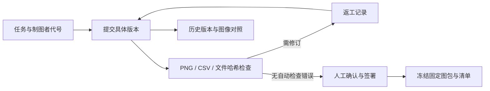

# 设计与核验边界

## 不变量

1. 所有状态修改声明当前工作台修订号；SQLite `BEGIN IMMEDIATE`事务拒绝过期请求，避免丢失并发修改。
2. 提交ID和版本标签唯一；文件按内容哈希保存。人工签署绑定当前提交ID，新提交不会继承历史通过状态。
3. 自动检查不产生人工通过记录。通过需要视觉、数据、图注三项明确确认与备注。
4. 返工和检查阻塞仍占用在途名额。每个制图者最多两张在途，验收通过后释放名额。
5. 冻结要求全部当前任务通过。先读取固定字节，再对这组字节检查并打包，避免校验和打包读取不同文件。
6. 冻结包含清单和每个文件的哈希；图包下载再次验证整包哈希。历史图包不随后续图件变化更新。

## 数据与服务

SQLite保存工作台快照和追加的事件。原型采用整个看板的乐观修订号，适合小规模本机使用；同一时刻只有一个写事务。文件放在`blobs/`，冻结包放在`releases/`。失败事务可能留下未被引用的文件；不会进入任务或交付包，当前没有自动清理功能。

服务固定绑定127.0.0.1，校验Host，拒绝跨来源JSON写入；静态路径为白名单，文件下载只能按已保存的ID访问。上传文件名禁止目录和盘符；图像仅支持PNG，源码按附件下载。HTML使用转义文本和内容安全策略，不执行上传文件或标签中的代码。

这些限制适用于本机原型，不能替代远程服务的账户认证、权限控制或运维措施。制图者代号仅用于分配和显示，不证明真实身份。

## 实现与未来功能

独立实现研究图件验收流程，没有复制团队工作台源码、原图或通信记录。相邻版本只提供图像对照；没有实现语义差分、PDF/SVG接入、模型视觉评审或GitHub派单。
